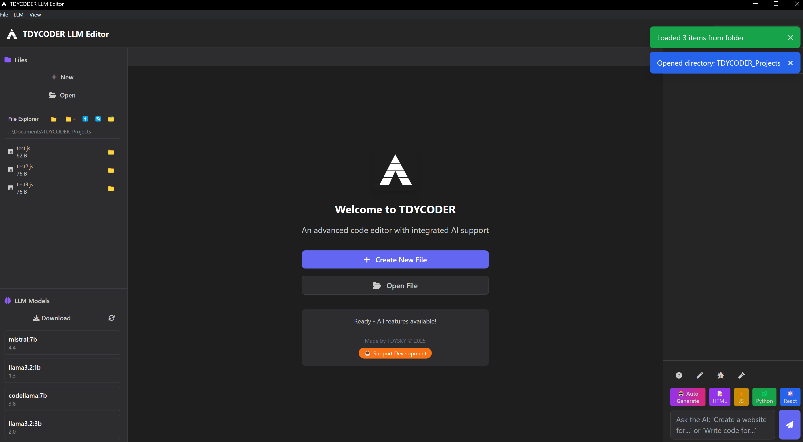

# TDYCODER LLM Editor

🤖 **Advanced AI-Powered Code Editor** - Created by TDYSKY © 2025

A professional code editor with integrated AI assistant powered by local LLM models. Experience the power of AI-assisted coding with complete privacy and offline capabilities.

## ✨ Features

### 🔥 Core Capabilities
- **Monaco Editor** - The same powerful editor engine used in VS Code
- **AI Assistant** - Built-in chat with local LLM models via Ollama integration
- **Multi-Language Support** - Syntax highlighting for JavaScript, Python, HTML, CSS, and 50+ languages
- **Auto-Complete** - Intelligent code completion and suggestions
- **File Management** - Built-in file explorer with project organization
- **Auto Generate** - Let AI create entire projects from simple descriptions

### 🚀 AI-Powered Features
- **Code Generation** - Generate functions, classes, and complete files
- **Code Explanation** - Get detailed explanations of complex code
- **Bug Detection** - AI-powered error detection and fixes
- **Project Creation** - Auto-generate complete web apps, APIs, games, and tools
- **Smart File Naming** - Intelligent file organization and naming

### 🛠️ Professional Tools
- **Project Explorer** - Visual file tree with directory navigation
- **Multiple Tabs** - Work on multiple files simultaneously  
- **Live File Creation** - Files are instantly saved to your PC
- **Export Projects** - Open generated projects directly in Windows Explorer
- **Modern UI** - Clean, professional interface with dark theme

## 📦 Installation

### Download & Run

1. **Download** the latest `TDYCODER-Setup.exe` from [Releases](/releases)
2. **Run** the installer and follow the setup wizard
3. **Launch** TDYCODER from your desktop or start menu

### Setup AI Features (Optional)

For AI assistant functionality:

1. **Install Ollama** from [ollama.ai](https://ollama.ai)
2. **Download a model**: `ollama pull llama3.2`
3. **Start Ollama service**: The app will detect it automatically

## 🎯 Quick Start

1. **Open TDYCODER** - Launch the application
2. **Select AI Model** - Choose from dropdown (if Ollama is installed)
3. **Create Files** - Use "New File" or AI "Auto Generate" 
4. **Start Coding** - Full Monaco Editor with AI assistance
5. **Export Projects** - All files are saved to your PC automatically

## 🤖 AI Auto Generate

Create complete projects instantly:

- 🌐 **Websites** - Full responsive websites with HTML, CSS, JS
- 📱 **Web Apps** - Interactive applications with modern features  
- 🎮 **Games** - Browser games with HTML5 Canvas
- 🛠️ **Tools** - Utility scripts and automation tools
- 🔧 **APIs** - REST APIs with Node.js and Express

Just describe what you want, and the AI builds it for you!

## 💻 System Requirements

- **OS:** Windows 10/11 (64-bit)
- **RAM:** 4GB minimum, 8GB recommended
- **Storage:** 500MB for application
- **Optional:** Ollama for AI features (additional 2-8GB for models)

## 🎨 Screenshots

*Professional interface with AI chat on the right, file explorer on the left, and Monaco Editor in the center.*

## 🆕 What's New in 2025

- Complete UI overhaul with modern design
- Enhanced AI integration with auto project generation
- Improved file management and project organization
- Better performance and stability
- Professional branding and user experience

## 🔧 Troubleshooting

**AI not working?**
- Install Ollama and download a model
- Check if Ollama service is running
- Select a model from the dropdown

**Files not saving?**
- Check write permissions in your project folder
- Use "Choose Project Folder" to select a different location
- Restart the application as administrator if needed

**Need help or want to give feedback?**
- Join our Discord community (see Community & Support section below)
- Check our troubleshooting guide above
- Try the quick fixes mentioned for common issues

## 📄 License

See [LICENSE](LICENSE) file for details.

## 👨‍💻 Created by TDYSKY

**Professional AI-powered development tools** 

© 2025 TDYSKY. All rights reserved.

### ☕ Support the Development

If you find TDYCODER useful, consider supporting future development:

### 💬 Community & Support

Join our Discord community for help, feedback, and discussions:

- 🐛 **Report bugs** and get help
- 💡 **Suggest features** and improvements  
- 🤝 **Connect** with other TDYCODER users
- 📢 **Get updates** on new releases

---

*Experience the future of coding with AI-powered assistance. Download TDYCODER today!*
